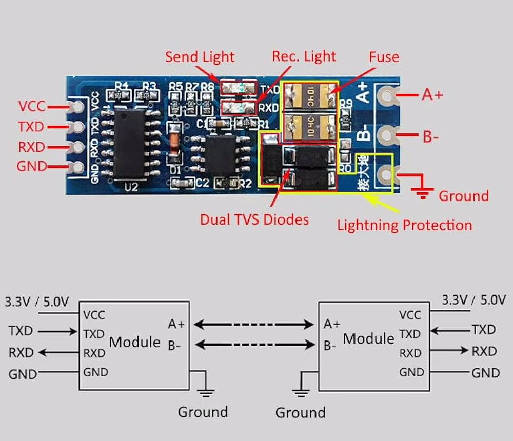

# Milk-V duo256M software setup

## Connect the RS485 module to Milkv



Milkv TX pin 1 to RS485 module pin TX

Milkv RX pin 2 to RS485 module pin RX

Milkv 3V3(OUT) pin 36 to RS485 module pin VCC

Milkv GND pin 38 to RS485 module pin GND

## Connect RS485 module to Orno meter

Meter pin A+ to RS485 module pin A+

Meter pin B- to RS485 module pin B-

Meter pin GND to RS485 module pin GND

# Milk-V duo256M software setup
## Create new user:
### Create home directory
```
mkdir /home
```
### Create user
```
adduser powerline
```
## Create init script that allow user write and read to the tty ports
```
vi /etc/init.d/S99devices_groups
```
insert text:
```
chgrp tty /dev/ttyS1
chmod g+wr /dev/ttyS1
chgrp tty /dev/ttyS2
chmod g+wr /dev/ttyS2
chgrp tty /dev/ttyS3
chmod g+wr /dev/ttyS3
chgrp tty /dev/ttyS4
chmod g+wr /dev/ttyS4
```
allow root execution
```
chmod u+rwx /etc/init.d/S99devices_groups
```
## Install python libraryes:
```
export MSGPACK_PUREPYTHON=true
pip install io minimalmodbus struct serial time os influxdb timeloop datetime sys
```
## Install program:
```
su powerline
cd /home/powerline
wget https://raw.githubusercontent.com/bigjohnson/orno-modbus-influxdb-grafana/refs/heads/master/modbus-influxdb.py
```
## Install startup scripts:
as root, if you are su as powerline type
```
exit
cd
```
create file
```
vi /root/executecommand.sh
```
with content
```
su powerline
/home/powerline/energymeter/modbus-influxdb.py > /dev/null &
exit
```
allow execution
```
chmod u+x /root/executecommand.sh
```
add the executecommand.sh in startup file
```
vi /mnt/system/auto.sh
```
insert at the end
```
/root/executecommand.sh
```
