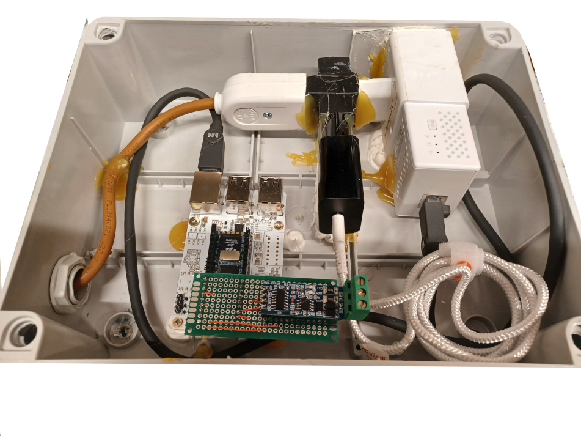

# orno-modbus-influxdb-grafana
Read ORNO OR-WE-514 ModbusRTU energy meter via RS485 serial, insert values to influxdb server and graph with grafana

view live data on https://grafana.panu.it/d/ht_7Qt07k/mainline-orno-or-we-514?orgId=1&refresh=1m


The script reads the values every 10 seconds from the energy meter and insert them to the influxdb server. Read-out and publish takes about 1 second for all values @ 9600 Baud speed and 2-3 seconds @ 2400 Baud speed.
I've use the default serial config: 9600 Baud / 8E1.

# Parts List
- ORNO OR-WE-514 Modbus RTU Energy Meter (https://www.amazon.de/Orno-Wechselstromz%C3%A4hler-1-Phasen-Stromz%C3%A4hler-Zertifikat-Energieverbrauch/dp/B07Q1J1GJ4/ref=sr_1_1)

- USB-RS485 ch341-uart converter (https://www.makershop.de/module/kommunikation-module/rs485-adapter/)


# Dependencies
Python libraries
- io
- minimalmodbus
- serial
- struct
- time
- timeloop
- datetime
- os
- influxdb
- sys

# Intallation:
```
pip3 install io minimalmodbus serial influxdb time timeloop datetime
```
other:
- influxdb server
- Linux Platform (testet on Debian Bullseye)
copy the script to a location of your choice. I've chosen /opt/modbus-influxdb/

```
cp modbus-influxdb.py /opt/modbus-influxdb/
```

change INSERTYOURDATA placeolder with your influxdb server need.

# Starting the script
```
# change directory
cd /opt/modbus-influxdb/
# first make the script executable:
chmod +x modbus-influxdb.py
# executing:
./modbus-influxdb.py
```

# Graph data

import the orno.json in your grafana and change the INSERTYOURDATA placeolder with your measurement, select your correct influxdb datasource.

# Harware with Milk-V Duo256M


